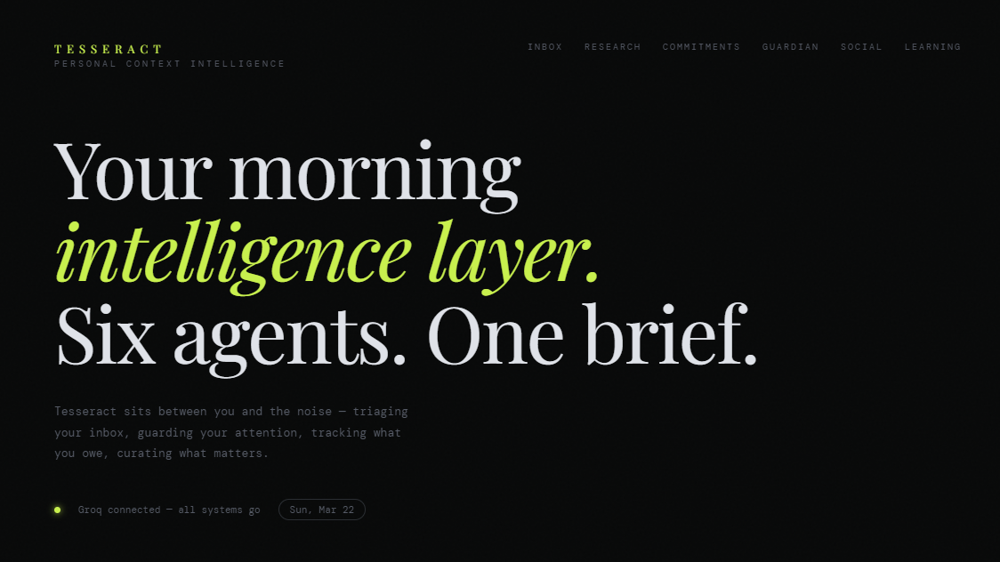
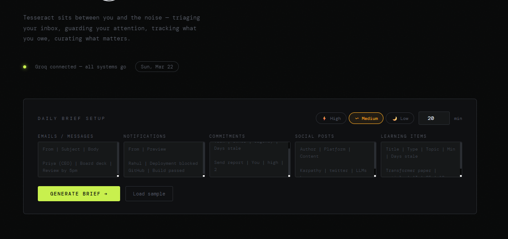
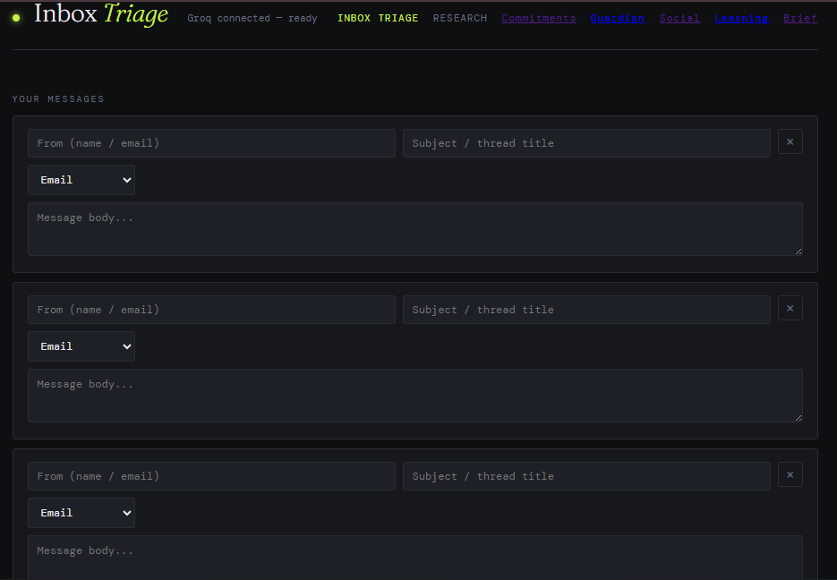
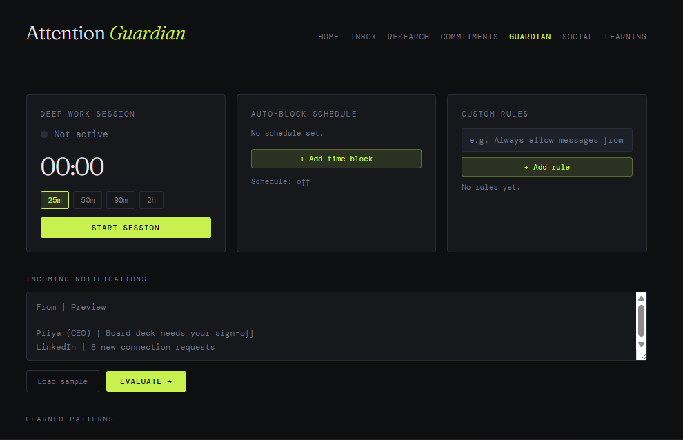
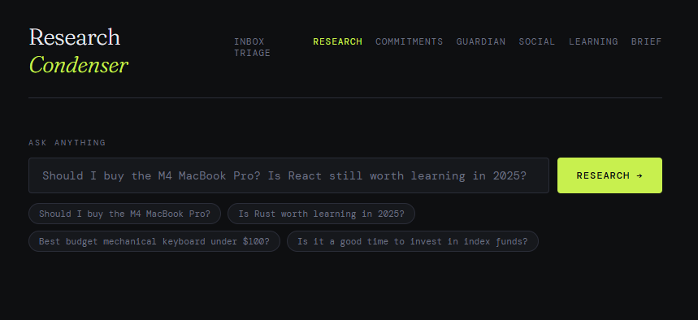
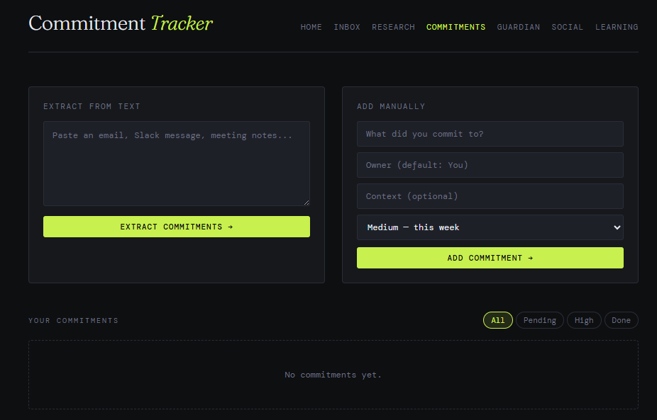
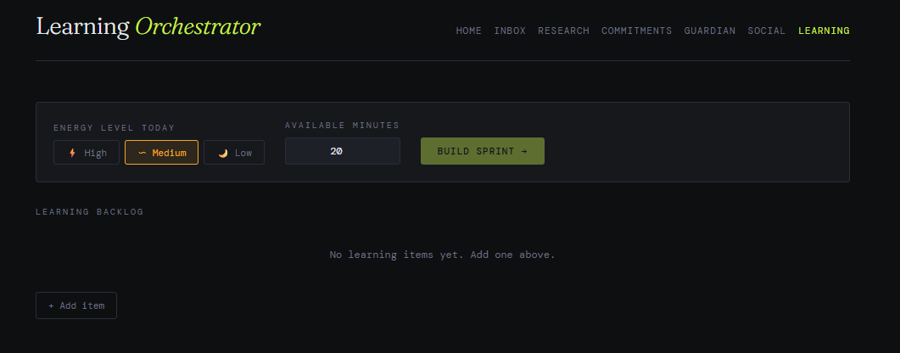
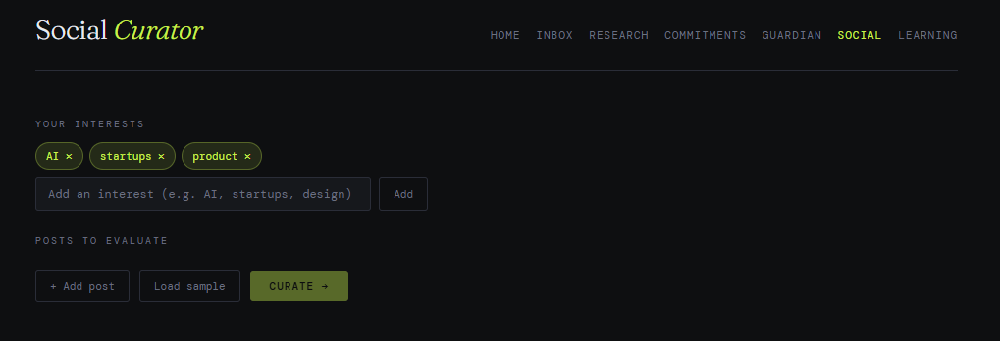

# Tesseract — Personal Context Intelligence System

> Your morning intelligence layer. Six agents. One brief.

Tesseract sits between you and the noise — triaging your inbox, guarding your attention, tracking what you owe, curating what matters. Built with FastAPI, LangGraph, and Groq's llama3, running fully locally or deployed to the cloud.



---

## What it does

Most people don't have an attention problem. They have an information management problem. Tesseract is a multi-agent system that acts as your personal executive function layer — it reads your context, makes decisions on your behalf, and surfaces only what actually matters.

Every morning, run the Daily Brief. Six agents fire in parallel, each handling a different slice of your cognitive load:

| Agent | What it does |
|---|---|
| **Inbox Triage** | Reads your emails and messages, surfaces the 3 that need you today, drafts replies for the rest |
| **Research Condenser** | You ask a question, it searches the web via Tavily, synthesizes a verdict with reasoning and confidence score |
| **Commitment Tracker** | Extracts commitments from text or lets you add them manually, tracks status, guilt-trips stale ones |
| **Attention Guardian** | Evaluates incoming notifications during deep work, allows or blocks based on your rules and learned patterns |
| **Social Curator** | Scores your feed for signal vs noise, picks the 3 posts worth engaging with, drafts genuine replies |
| **Learning Orchestrator** | Takes your backlog of articles and videos, builds a focused daily sprint based on your energy level |

---

## Architecture

```
Frontend (Vercel)          Backend (Render)
static/                    server.py (FastAPI)
├── brief.html    ──────►  /daily-brief
├── index.html    ──────►  /triage
├── research.html ──────►  /research (Tavily + Groq)
├── commitments   ──────►  /extract-commitments
├── guardian.html ──────►  /guardian
├── social.html   ──────►  /social-curate
└── learning.html ──────►  /learning-orchestrate
                           
                           LangGraph Orchestrator
                           ┌─────────────────────┐
                           │ router               │
                           │   ↓                  │
                           │ [parallel agents]    │
                           │  triage  guardian    │
                           │  social  learning    │
                           │  commitments         │
                           │   ↓                  │
                           │ hitl_gate            │
                           │   ↓                  │
                           │ synthesize           │
                           └─────────────────────┘
                           
                           SQLite (tesseract.db)
                           ├── commitments
                           ├── learning_items
                           ├── guardian_history
                           ├── social_interests
                           └── guardian_rules
```

---

## Screenshots

### Daily Brief


### Inbox Triage


### Attention Guardian


### Research Condenser


### Commitment Tracker


### Learning Orchestrator


### Social Curator


---

## Tech Stack

| Layer | Tech |
|---|---|
| Frontend | Vanilla HTML/CSS/JS — no framework |
| Backend | FastAPI + Python |
| Orchestration | LangGraph (parallel agents, HITL gate, state persistence) |
| LLM | Groq API — llama-3.1-8b-instant |
| Web Search | Tavily API |
| Database | SQLite via Python's built-in `sqlite3` |
| Frontend hosting | Vercel |
| Backend hosting | Render |

---

## LangGraph Implementation

The Daily Brief uses a proper LangGraph state machine:

- **Router node** — checks which inputs are present, sets flags to skip agents with no data
- **Parallel agents node** — fires all enabled agents simultaneously with `asyncio.gather`
- **HITL gate** — pauses execution if Guardian confidence < 70% or commitments are 7+ days stale, surfaces items for human review
- **Synthesize node** — merges all agent outputs, generates a plain-English morning summary

State is persisted via `MemorySaver` so HITL sessions can resume after human input.

---

## Local Setup

**Prerequisites:** Python 3.10+, a Groq API key, a Tavily API key

```bash
# Clone
git clone https://github.com/shrutii-26/Tesseract.git
cd Tesseract

# Create virtual environment
python -m venv venv
venv\Scripts\activate  # Windows
source venv/bin/activate  # Mac/Linux

# Install dependencies
pip install -r requirements.txt

# Create .env file
echo GROQ_API_KEY=your_groq_key > .env
echo TAVILY_API_KEY=your_tavily_key >> .env

# Run
uvicorn server:app --reload
```

Then open `static/brief.html` with Live Server in VS Code, or any static file server.

---

## Deployment

**Backend → Render**
- Connect your GitHub repo
- Build command: `pip install -r requirements.txt`
- Start command: `uvicorn server:app --host 0.0.0.0 --port 10000`
- Add `GROQ_API_KEY` and `TAVILY_API_KEY` as environment variables

**Frontend → Vercel**
- Import GitHub repo
- Set root directory to `static`
- No build command needed
- Deploy

---

## API Keys

| Key | Where to get it | Free tier |
|---|---|---|
| Groq | https://console.groq.com | Yes — generous limits |
| Tavily | https://app.tavily.com | Yes — 1000 searches/month |

---

## Roadmap

- [ ] Meta-Agent — weekly reflection on override patterns, auto-adjusts Guardian thresholds
- [ ] Browser notifications for Guardian alerts
- [ ] Twitter/X and LinkedIn OAuth for live feed ingestion
- [ ] PostgreSQL for production-grade persistence
- [ ] Mobile-responsive UI

---

## Project Structure

```
tesseract/
├── server.py          # FastAPI backend — all agent routes + LangGraph brief
├── database.py        # SQLite layer — all DB operations
├── requirements.txt
├── .env               # API keys (not committed)
├── .gitignore
└── static/
    ├── brief.html     # Home page + Daily Brief dashboard
    ├── index.html     # Inbox Triage Agent
    ├── research.html  # Research Condenser
    ├── commitments.html # Commitment Tracker
    ├── guardian.html  # Attention Guardian
    ├── social.html    # Social Curator
    └── learning.html  # Learning Orchestrator
```

---


